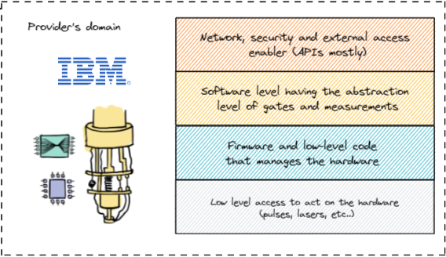
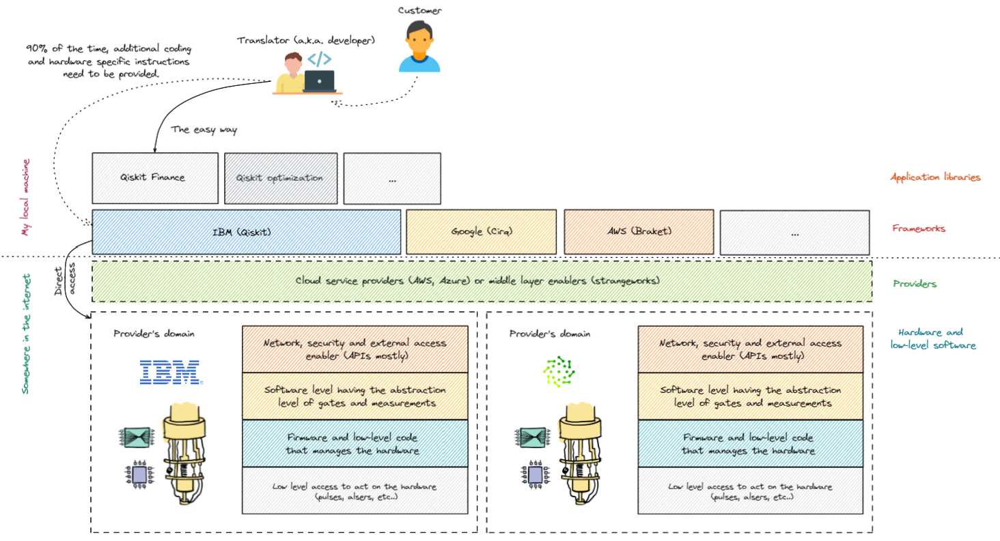
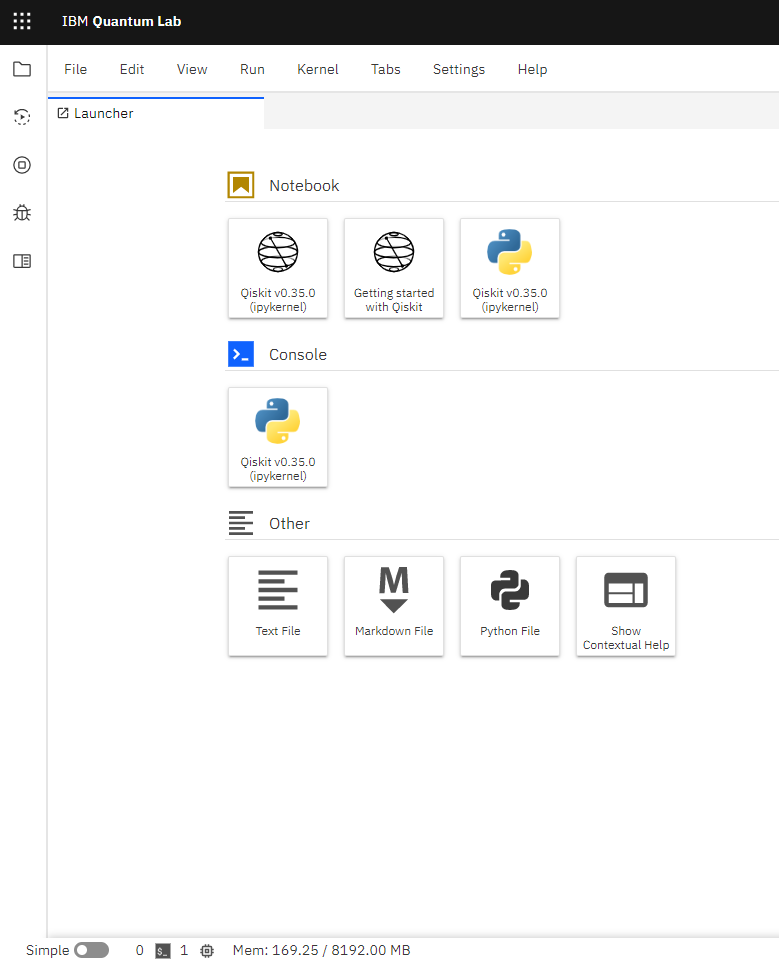
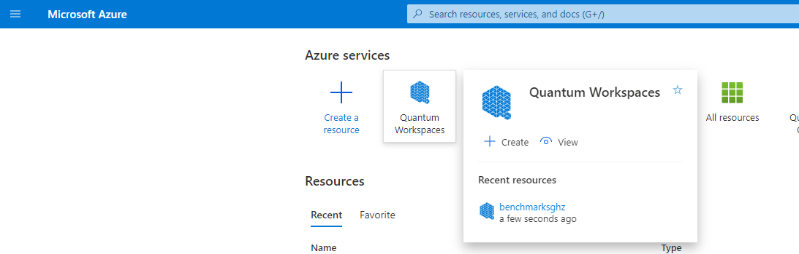
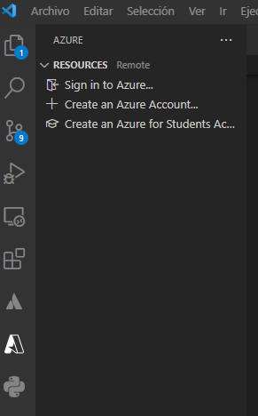
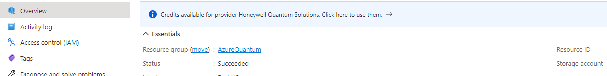
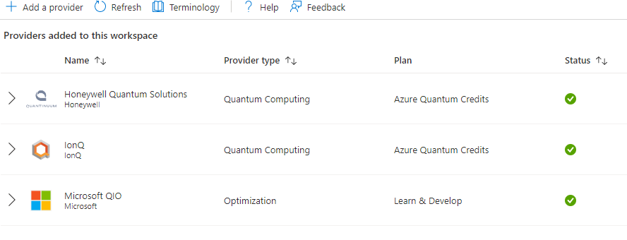

# Qiskit-101

A simple repository that contains examples on how to use Qiskit against different service providers. Qiskit being a python framework for quantum algorithm definition allows this codes to be sent nativelly to their cloud or via plugin to [cloud](https://quantum-computing.ibm.com/) service providers offering a set of devices to which same algoirthm will be shiped and traspiled to.

## Background

Even though the circuits we might define are colourfull and simple, the device they on are quite complicated to handle. There is a whole set of layers our instructions go through in order to finally act on the qubits of the device itself.



In order to understand the layers our examples will be composed by, we hope following image may help visualizing the levels of abstraction a simple code may go trhough and how sometimes, device specific tweaking will be mandatory.



So, the role Qiskit plays is the abstraction (up to a point) on how we would like that hardware to be treated and measured afterwards according to our experimental setting.

# Requirements 
## Installation

Python is required in order to run this exercises and ideally, a virtual environment be used so that required dependencies are contained within this virtual environment (for reproducibility purpouses).

```
pip install -r requirements.txt
```

## Services

Mostly our examples will run on IBM's devices so an account will be needed when real devices are used and if the notebooks are run on a local machine instead on [IBM Quantum's](https://quantum-computing.ibm.com/) Lab service:



Then the service token need to be retrieven from the website in order to use it locally and enable the comunication between local the local machine and the remote service.


This *secrets* can be placed on a local _.env_ file so that it gets preserved from being hardcoded on any exercise.

## Azure services

Microsofts cloud service, Azure, offers a quantum computing service so that several devices from different vendors are accessible. This is interesting due to the fact that each device may use a different tecnology for qubit implementation and this affects the noise, connectivity and ultimatelly, the results of our experiments. Therefore, it is interesrting to have an understanding on the different devices available in order to chose the approriate ones.

In order to gain access to this, you will need to access Azure's [portal](https://portal.azure.com/#home) and create a Quatum workspace:



It may require to enter a valid credit card but hopefully all providers offer a certain amount of free runs so there is no need to pay for this examples to run.

Azure's qiskit plugin is already loaded in the requirements of the repository but a local connection will also be needed from the service provider in order to identify who the invoking party is. If one uses Visual Studio Code, this is already handled by the azure plugin, so it is only needed to sign in.



With that, reosource ID can be retrieved from the created workspace:



And different provider resources will be available as we will explore on the example notebooks.



# Author

Iraitz Montalbán